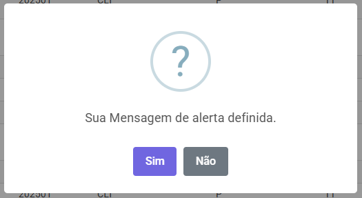

# 📘 SweetAlert2.Blazor

## 📑 Sumário

- [Introdução](#-introdução)
- [Recursos do Pacote](#-recursos-do-pacote)
- [Instalação](#-instalação)
- [Configuração](#️-configuração)
  - [Blazor WebAssembly](#blazor-webassembly)
  - [Blazor Server](#blazor-server)
- [Arquitetura do Pacote](#-arquitetura-do-pacote)
- [Modelos (Models)](#-modelos-models)
- [Serviço SweetAlert2Service](#️-serviço-sweetalert2service)
- [Métodos Helper](#-métodos-helper)
- [Enumerações Suportadas](#-enumerações-suportadas)
- [Retornos (Results)](#-retornos-results)
- [Exemplos Avançados](#-exemplos-avançados)
- [Erros Comuns](#-erros-comuns)
- [Roadmap](#️-roadmap)
- [Changelog](#-changelog)
- [Contribuições](#️-contribuições)
- [Licença](#-licença)

---

## 🧩 Introdução

O **SweetAlert2.Blazor** é um wrapper robusto, tipado e moderno para exibir alertas do **SweetAlert2** em aplicações Blazor WebAssembly e Blazor Server usando JSInterop.

O principal objetivo é fornecer uma **API C# limpa, intuitiva e 100% assíncrona**.

### 🧪 Exemplos



---

## 🔥 Recursos do Pacote

| Função | Suportado |
|--------|----------|
| Alertas básicos | ✔️ |
| Alertas de sucesso/erro/aviso | ✔️ |
| Alertas de confirmação | ✔️ |
| Botões customizados | ✔️ |
| Retorno assíncrono detalhado | ✔️ |
| Helpers para criação rápida | ✔️ |
| Registro automático via _content | ✔️ |
| Zero dependências externas | ✔️ |
| 100% compatível com Blazor WASM | ✔️ |

---

## 📦 Instalação

```bash
dotnet add package SweetAlert2.Blazor
```

---

## ⚙️ Configuração

### Blazor WebAssembly

**Program.cs:**

```csharp
builder.Services.AddSweetAlert2();
```

**wwwroot/index.html:**

```html
<script src="https://cdn.jsdelivr.net/npm/sweetalert2@11"></script>
<script src="_content/SweetAlert2.Blazor/sweetalert-wrapper.js"></script>
```

### Blazor Server

**Program.cs:**

```csharp
builder.Services.AddSweetAlert2();
```

**_Host.cshtml:**

```html
<script src="https://cdn.jsdelivr.net/npm/sweetalert2@11"></script>
<script src="_content/SweetAlert2.Blazor/sweetalert-wrapper.js"></script>
```

---

## 🧱 Arquitetura do Pacote

```
SweetAlert2.Blazor/
│
├── Extensions/
├── Helpers/
├── Models/
├── Services/
└── wwwroot/
```

**Fluxo funcional:**

```
C# (SweetAlert2Service) 
   → JSInterop 
      → sweetalert-wrapper.js 
         → Swal.fire() 
            → retorna SweetAlert2Return para C#
```

---

## 📂 Modelos (Models)

### SweetAlert2Options

Define todas as opções possíveis para um alerta.

**Propriedades principais:**

| Propriedade | Tipo | Descrição |
|------------|------|----------|
| Titulo | string | Título do alerta |
| Texto | string | Corpo do alerta |
| Icone | ESweetAlert2Icone | Tipo do ícone |
| TextoDoBotaoConfirmar | string | Texto do botão OK |
| TextoDoBotaoCancelar | string? | Texto do botão Cancelar |
| MostrarBotaoFechar | bool | Mostrar X |
| PermitirClicarFora | bool | Fecha ao clicar fora |

### SweetAlert2Model

Wrapper usado pelo serviço.

---

## 🏗️ Serviço: SweetAlert2Service

**API exposta:**

```csharp
ValueTask<SweetAlert2Return> Alert(SweetAlert2Model alert);
```

**Uso:**

```csharp
@inject ISweetAlert2Service Swal

await Swal.Alert(new SweetAlert2Model(...));
```

---

## 🛠️ Métodos Helper

A classe `SweetAlert2Helper` facilita a criação de alertas.

**Exemplos:**

```csharp
SweetAlert2Helper.CreateSuccessAlert(...)
SweetAlert2Helper.CreateErrorAlert(...)
SweetAlert2Helper.CreateWarningAlert(...)
SweetAlert2Helper.CreateConfirmAlert(...)
SweetAlert2Helper.CreateConfirmYNAlert(...)
```

---

## 🧭 Enumerações Suportadas

### ESweetAlert2Icone

- `success`
- `error`
- `warning`
- `info`
- `question`

---

## 🎯 Retornos (Results)

Objeto retornado ao clicar, confirmar ou fechar:

```csharp
public class SweetAlert2Return
{
    public bool IsConfirmed { get; set; }
    public bool IsDismissed { get; set; }
    public string? DismissReason { get; set; }
}
```

**Exemplo:**

```csharp
var result = await Swal.Alert(...);

if (result.IsConfirmed)
    Console.WriteLine("Usuário confirmou");
```

---

## 🧪 Exemplos Avançados

### 1. Alerta com validação

```csharp
var alert = SweetAlert2Helper.CreateConfirmAlert(
    "Deseja excluir?",
    "Esta ação é irreversível!"
);

var result = await Swal.Alert(alert);

if (result.IsConfirmed)
{
    await DeleteItemAsync();
}
```

### 2. Alerta com botão customizado

```csharp
var alert = new SweetAlert2Model(new SweetAlert2Options(
    "Salvar alterações?",
    "Confirme para continuar",
    ESweetAlert2Icone.INFO,
    "Salvar",
    "Cancelar"
));

await Swal.Alert(alert);
```

### 3. Recomendação de uso com ComponentBase
Futuramente será empacotado para facilitar o uso via herança.

``` csharp
public class SweetAlertBlazorService(ISweetAlert2Service service) : IAlertService
{
    public Task<SweetAlert2Return> ShowAsync(SweetAlert2 alert)
        => service.Alert(alert).AsTask();
}
```

``` csharp
public class SweetAlertFactory : IAlertFactory
{
    public SweetAlert2 FromOptions(SweetAlert2Options options)
        => SweetAlert2Helper.CreateAlert(options);

    public SweetAlert2 Success(string title, string message)
        => SweetAlert2Helper.CreateSuccessAlert(title, message);

    public SweetAlert2 Error(string title, string message)
        => SweetAlert2Helper.CreateErrorAlert(title, message);

    public SweetAlert2 Info(string title, string message)
        => SweetAlert2Helper.CreateInfoAlert(title, message);

    public SweetAlert2 Warning(string title, string message)
        => SweetAlert2Helper.CreateWarningAlert(title, message);

    public SweetAlert2 Confirm(string title, string message)
        => SweetAlert2Helper.CreateConfirmAlert(title, message);

    public SweetAlert2 ConfirmYesNo(string title, string message)
        => SweetAlert2Helper.CreateConfirmYNAlert(title, message);
}
```

``` csharp
/// <summary>
/// Classe base para páginas Blazor que estende a funcionalidade de alertas utilizando o serviço SweetAlert2.
/// Esta classe fornece métodos genéricos para exibir diferentes tipos de alertas (sucesso, erro, confirmação, etc.).
/// </summary>
public abstract class BaseAlertPage : ComponentBase
{
    [Inject] protected IAlertService Alerts { get; set; } = default!;
    [Inject] protected IAlertFactory AlertFactory { get; set; } = default!;

    #region Generic Alert Methods

    protected Task<SweetAlert2Return> ShowAlertAsync(SweetAlert2 alert)
        => Alerts.ShowAsync(alert);

    #endregion

    #region Custom Alerts

    protected Task<SweetAlert2Return> Alerta(SweetAlert2Options options)
        => ShowAlertAsync(AlertFactory.FromOptions(options));

    protected Task<SweetAlert2Return> AlertaSucesso(string texto)
        => ShowAlertAsync(AlertFactory.Success("Sucesso!", texto));

    protected Task<SweetAlert2Return> AlertaSucesso(string titulo, string texto)
        => ShowAlertAsync(AlertFactory.Success(titulo, texto));

    protected Task<SweetAlert2Return> AlertaErro(string texto)
        => ShowAlertAsync(AlertFactory.Error("Erro!", texto));

    protected Task<SweetAlert2Return> AlertaErro(string titulo, string texto)
        => ShowAlertAsync(AlertFactory.Error(titulo, texto));

    protected Task<SweetAlert2Return> AlertaFalha(string texto)
        => ShowAlertAsync(AlertFactory.Warning("Informação", texto));

    protected Task<SweetAlert2Return> AlertaAviso(string texto)
        => ShowAlertAsync(AlertFactory.Warning("Atenção!", texto));

    protected Task<SweetAlert2Return> AlertaInfo(string texto)
        => ShowAlertAsync(AlertFactory.Info("Informação", texto));

    protected Task<SweetAlert2Return> AlertaInfo(string titulo, string texto)
        => ShowAlertAsync(AlertFactory.Info(titulo, texto));

    protected Task<SweetAlert2Return> AlertaConfirmacao(string texto)
        => ShowAlertAsync(AlertFactory.Confirm(string.Empty, texto));

    protected Task<SweetAlert2Return> AlertaConfirmacaoYN(string texto)
        => ShowAlertAsync(AlertFactory.ConfirmYesNo(string.Empty, texto));

    #endregion
}
```

---

## ❗ Erros Comuns

### ❌ "Cannot find module sweetalert-wrapper.js"

**Causa:** esqueceu de incluir o script do SweetAlert2  
**Solução:** incluir `<script src="https://cdn.jsdelivr.net/npm/sweetalert2@11"></script>`

### ❌ Retorno sempre nulo

**Causa:** não serializou corretamente o model  
**Solução:** verifique nomes das propriedades no JS wrapper

---

## 📝 Changelog

### v1.0.0

- Versão inicial
- Serviço + helpers + modelos + wrapper JS

## ❤️ Contribuições

Pull requests são bem-vindos! Se você encontrou algum problema, tem sugestões de melhorias ou quer adicionar novas features, sinta-se à vontade para:

1. Fazer um fork do projeto
2. Criar uma branch para sua feature (`git checkout -b feature/MinhaFeature`)
3. Commitar suas mudanças (`git commit -m 'Adiciona MinhaFeature'`)
4. Fazer push para a branch (`git push origin feature/MinhaFeature`)
5. Abrir um Pull Request

Também é possível abrir uma issue para reportar bugs ou sugerir melhorias.

---

## 📄 Licença

Este projeto está licenciado sob a **MIT License** - veja o arquivo [LICENSE](LICENSE) para mais detalhes.

Livre para uso comercial e pessoal.

---

**Desenvolvido com ❤️ por [RM Tech Solutions](https://github.com/RM-Tech-Solutions-Ltda)**
